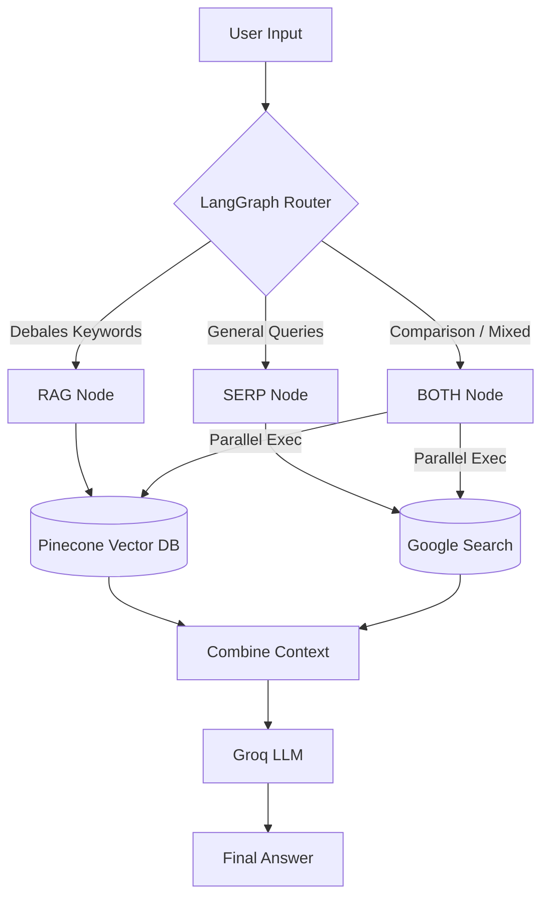
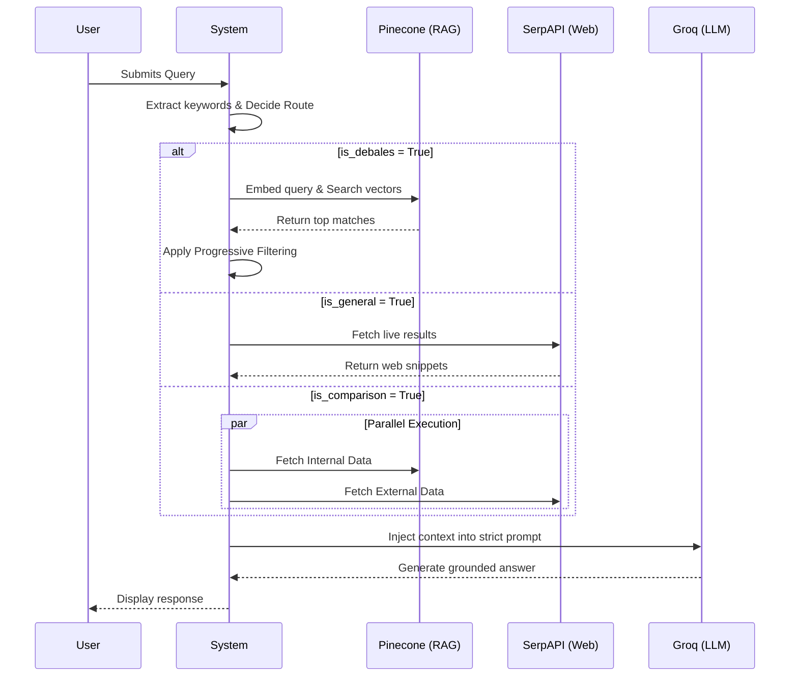

# Debales AI Assistant
video link:  (https://drive.google.com/drive/folders/1zuQBiFk5_Q78_LQbkpJ81jRkX9dodVh1)
## 1. Project Title & Description

**Debales AI Assistant** is an intelligent context-aware logistics chatbot designed to handle both internal company knowledge and external world data seamlessly. 

The system relies on a hybrid **RAG (Retrieval-Augmented Generation) + Tool Calling** approach. When a user asks a question, the system determines the intent and orchestrates whether to pull contextual data from an internal knowledge base (Pinecone vector database), search the live web (SERP API), or combine both sources. The resulting context is fed into a highly capable LLM (Groq) to deliver grounded, hallucination-free answers.

---

## 2. Architecture Overview

The system is highly modular, consisting of several core components working in unison:

- **Router (LangGraph):** The brain of the orchestration. Analyzes the query to detect keywords for comparison, external entities, or Debales logistics functionality, then routes the decision to the proper data retrieval nodes.
- **RAG (Pinecone & Sentence Transformers):** Handles vector similarity search. Queries are embedded using `all-MiniLM-L6-v2` and searched against a Pinecone index containing Debales' proprietary documentation and product specs.
- **SERP API (Google Search):** Acts as the tool calling agent for external knowledge. Pulls real-time Google search text snippets for non-Debales queries.
- **LLM (Groq `llama-3.1-8b-instant`):** Generates the final grounded answer. Enforced via strict prompt engineering to answer *only* based on the context provided, completely eliminating hallucinations.
- **Streamlit Backend/UI:** Provides the interactive chatbot interface.

---

## 3. Workflow 

The application follows a strictly defined LangGraph state workflow:



1. **User Query Input:** The user submits a question via the Streamlit interface.
2. **Router Evaluation:** 
   - Uses hardcoded keyword detection (comparison terms, external tools, internal product terms) to make an instant routing decision.
3. **Execution Routing (RAG / SERP / BOTH):**
   - **RAG Node:** Fetches Pinecone data for Debales queries.
   - **SERP Node:** Fetches Google search data for external queries.
   - **BOTH Node:** Runs Pinecone retrieval and SERP API parallelly via `ThreadPoolExecutor` to optimize latency.
4. **Context Building & Formatting:** Consolidates retrieved context and checks for data availability. Handles fallbacks (e.g., if SERP fails).
5. **LLM Generation:** The context and the query are passed to the Groq LLM using route-specific system prompts.
6. **Final Answer Formulation:** The generated answer is surfaced to the user.

---

## 4. Data Flow



1. **Query Embedding & Retrieval:** When routed to RAG, the query is converted into a 384-dimensional vector using Sentence Transformers. The vector queries the `debales-ai` Pinecone index. `top_k` results are progressively filtered (score > 0.4, no noise keywords, business relevant).
2. **Web Snippet Extraction:** When routed to SERP, the query is passed to SerpApi. The JSON response extracts the top 5 `organic_results` and combines their `title` and `snippet`.
3. **Synthesis:** The gathered text (internal docs, web snippets, or both) is injected directly into a prompt template alongside the user's initial query and routed to the Groq LLM API. 

---

## 5. Tech Stack

- **LangGraph:** Orchestrates conditional routing logic and State management.
- **Pinecone:** Serverless continuous vector database housing RAG embeddings.
- **Sentence Transformers (`all-MiniLM-L6-v2`):** Fast, local, and highly efficient embeddings model.
- **SerpAPI:** Developer API to cleanly scrape and parse Google Search engine payload.
- **Groq API & LLaMA 3.1 8B:** Extreme-speed inference engine using the powerful Llama 3 open-source model.
- **Streamlit:** Python library for building simple data-centric web applications and UI interfaces.

---

## 6. Folder Structure

```text
debales-chatbot/
│── graph.py            # LangGraph Router and workflow builder 
│── rag.py              # Pinecone Vector DB retrieval & filtering logic
│── serp.py             # SerpAPI external tool caller
│── llm.py              # Groq integration & dynamic prompt templates
│── streamlit_app.py    # Frontend Streamlit chat UI
│── requirements.txt    # Project dependencies
│── .env                # Environment keys
```

*(Note: `graph.py` maps to the router logic, orchestrating nodes for execution).*

---

## 7. Setup Instructions

1. **Clone the repository:**
   ```bash
   git clone <repository_url>
   cd debales-chatbot
   ```

2. **Install dependencies:**
   ```bash
   pip install -r requirements.txt
   ```

3. **Add API Keys:**
   Create a `.env` file in the root directory and add:
   ```env
   PINECONE_API_KEY=your_pinecone_key_here(pcsk_2yXJZN_9gkMEtw4D5mqCUEtehyWxeLJvx4ArMC5GgAgdFeqFAdm4Cqsx3CrQYwM6xTDmL3) 
  ** **i provide you the pinecone api key so that you can access my cloude database we i stored the vector embaddings ****
   GROQ_API_KEY=your_groq_key_here
   SERPAPI_API_KEY=your_serpapi_key_here
   ```

4. **Run the Streamlit UI:**
   ```bash
   streamlit run streamlit_app.py
   ```

---

## 8. Routing Logic Explanation

The core intelligence of the agent lies within its routing logic inside `graph.py`:

- **RAG Route:** Triggered exclusively when the query contains Debales-specific keywords (e.g., "logistics", "freight broker", "messometer"). It safely queries internal proprietary logic.
- **BOTH Route:** Triggered when the user explicitly uses comparison keywords ("vs", "compare", "difference") or explicitly mentions external competitor AI tools ("chatgpt", "openai"). It retrieves Pinecone data *and* Google data concurrently to form a strong comparative answer.
- **SERP Route:** Triggered for all general queries (e.g., "What is machine learning?") preventing the internal Pinecone database from being spammed with out-of-scope questions.

---

## 9. Input & Output Examples

### Example 1 (RAG)
**Input:** What does Debales AI do?
**Output:** Debales AI is an autonomous logistics automation platform that provides AI agents for supply chains. It automates freight quoting, carrier sourcing, and customer service across Email, Chat, and SMS for 3PLs and freight brokers.

### Example 2 (SERP)
**Input:** What is the current release of ChatGPT?
**Output:** Based on the available web data, the most recent major model release from OpenAI is GPT-4o. 

### Example 3 (BOTH)
**Input:** How does Debales AI differ from ChatGPT?
**Output:** ChatGPT is a general-purpose AI tool built by OpenAI used for broad conversational tasks. Debales AI is a specialized logistics automation AI built specifically for 3PLs and freight brokers, automating tasks like dispatch, load building, and ETA requests via connected transportation systems (TMS/WMS).

### Example 4 (Fallback)
**Input:** How do I bake a chocolate cake?
**Output:** I don't know based on the available information.

### Example 5 (Error Handling)
**Input:** What is the latest competitor to Debales AI? *(System triggers BOTH route, but SERP API goes down)*
**Output:** *(Fails successfully via gracefully bypassing SERP error and answering exclusively with RAG)* Debales AI competes in the logistics AI space to provide load building and automated quoting. I don't have access to live external competitor data at the moment.

---

## 10. Features

- **Progressive RAG Filtering:** Dynamically restricts low-score documents.
- **Tool Calling:** Live Google Search queries via SerpAPI.
- **Smart Routing Workflow:** Deterministic LangGraph conditional logic.
- **Parallelized Processing:** `ThreadPoolExecutor` ensures RAG and SERP fire simultaneously for rapid responses.
- **Zero Hallucination:** Strict LLM prompting ensures answers remain contextually grounded.
- **Graceful Error Handling:** Full API failover mechanisms.

---

## 11. Challenges & Solutions

- **Context Noise:** 
  *Problem:* RAG initially retrieved irrelevant testimonials or website junk data. 
  *Solution:* Developed a multi-stage **Progressive Filtering Algorithm** inside `rag.py`. It explicitly rejects noisy keywords and demands high confidence scoring, falling back gracefully to raw scores only if necessary.
- **Wrong Routing for Comparisons:** 
  *Problem:* Queries comparing Debales to external tools were routed strictly to RAG resulting in blind spots.
  *Solution:* Added an intent detection layer looking for entity and comparison keywords to route to the BOTH layer.
- **SERP/API Failure Handling:** 
  *Problem:* Network failures crashed the LLM prompt resulting in terrible UX.
  *Solution:* Established a `SERP_ERROR` flag string that the graph intercepts. The graph then securely downgrades the `BOTH` route to a pure `RAG` route on-the-fly and applies the appropriate system prompt.

---

## 12. Future Improvements

- **Cross-Encoder Re-Ranking:** To rank RAG vectors for mathematically perfect relevance.
- **Agentic Memory Engine:** To maintain conversational chat history within the LangGraph state.
- **Caching Mechanism:** Using Redis or local dictionaries to avoid fetching repeat SerpAPI parameters.
- **Multi-Agent System:** Utilizing separate, distinct LLMs (e.g., LLaMA for summarization, GPT-4o for code execution) for diverse enterprise actions. 

---

## 13. Demo Explanation

**How to present this in an interview:**

1. **Highlight the Architecture First:** Show how you aren't just sending blind prompts to an LLM. Open `graph.py` and explain how LangGraph manages state deterministically, acting as the "CEO" routing queries appropriately.
2. **Focus on Latency:** Explain how you explicitly optimized the `BOTH` workflow by wrapping I/O bound queries (Pinecone + SerpApi) into a ThreadPoolExecutor to run concurrently.
3. **Show Off Error Handling:** Discuss how system reliability matters. Demonstrate what happens when a third-party tool goes offline, specifically how the chatbot degrades gracefully rather than throwing ugly stack traces or hallucinating answers.
4. **Run Live Queries:** Specifically show queries targeting all 3 paths. Make sure to present the routing side-panel on the Streamlit UI to validate the structural choices to the judge.
